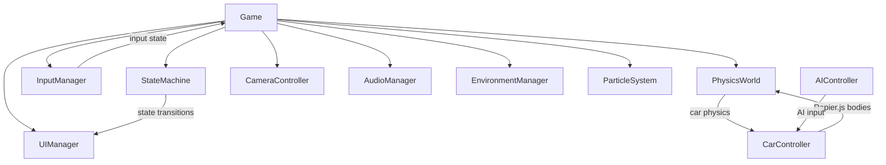

# Architecture Spine — OCBP Racer

## Design Paradigm

**Component-based game loop with centralized state machine.** Each system (physics, rendering, audio, input, AI, UI) is an independent module managed by a central Game class. The state machine governs screen transitions and game flow. Physics runs at fixed timestep (120Hz) with accumulator pattern; rendering runs at variable frame rate.



## Invariants & Rules

### AD-1 — Fixed Timestep Physics [ADOPTED]

- **Binds:** physics, car movement, collision detection
- **Prevents:** physics instability from variable frame rates
- **Rule:** Physics steps at 1/120s (8.33ms). Accumulator pattern: `accumulator += deltaTime; while (accumulator >= PHYSICS_TIMESTEP) { updatePhysics(PHYSICS_TIMESTEP); accumulator -= PHYSICS_TIMESTEP; }`. Frame time capped at 0.1s to prevent spiral of death.

### AD-2 — State Machine Governs Flow [ADOPTED]

- **Binds:** all game states, UI screens
- **Prevents:** inconsistent state transitions, orphaned screens
- **Rule:** Single StateMachine instance. States: MENU → CAR_SELECT → CAR_PREVIEW → TRACK_SELECT → COUNTDOWN → RACING → RESULTS → MENU. Additional states: PAUSED, SETTINGS, LEADERBOARD, DEMO. Each state has registered listeners; transitions trigger UI screen changes.

### AD-3 — Input Merge Strategy [ADOPTED]

- **Binds:** keyboard, gamepad input
- **Prevents:** input conflicts, lost inputs
- **Rule:** Keyboard and gamepad states are merged via OR logic: `throttle: gpState.throttle || kbState.throttle`. Gamepad takes precedence when connected. Dead zone: 0.15. Steer curve exponent: 1.4. Rebindable via localStorage persistence.

### AD-4 — Procedural Audio Synthesis [ADOPTED]

- **Binds:** all audio (engine, tire, wind, UI, collision)
- **Prevents:** external audio file dependencies, WAV loading failures
- **Rule:** All audio is synthesized via Web Audio API oscillators and noise buffers. Engine: dual oscillators (primary + secondary) with frequency scaling from baseFrequency to maxFrequency based on RPM ratio. Tire/Wind: filtered white noise. UI: simple tone generation. No external audio files.

### AD-5 — HTML/CSS Overlay UI [ADOPTED]

- **Binds:** all UI screens (menu, HUD, settings, results)
- **Prevents:** canvas-based UI complexity, poor text rendering
- **Rule:** UI is HTML/CSS overlay on top of Three.js canvas. Fixed positioning with pointer-events management. Rajdhani font, neon green (#00ff88) primary. Responsive scaling via CSS transform (0.5-1.0 scale factor). Gamepad focus via .gp-focus class.

### AD-6 — Physics-Render Separation [ADOPTED]

- **Binds:** game loop, physics, rendering
- **Prevents:** physics tied to frame rate, visual artifacts
- **Rule:** Physics and rendering are decoupled. Physics runs in fixed-timestep accumulator; rendering runs every frame. Camera updates after physics. Particles and weather update with frame deltaTime.

## Consistency Conventions

| Concern | Convention |
| --- | --- |
| File naming | PascalCase classes, camelCase functions, kebab-case files |
| Module structure | One major class per file, exported as named export |
| State management | StateMachine class with typed states and listeners |
| Configuration | CarConfigs.ts, TrackDefinitions.ts with typed interfaces |
| Persistence | localStorage with typed JSON serialization |
| Error handling | Try/catch with console.warn, graceful degradation |
| Type safety | TypeScript strict mode, no `any` types |

## Stack

| Name | Version |
| --- | --- |
| TypeScript | 7.x |
| Three.js | r185+ |
| Rapier.js | 0.19.3 |
| Vite | 5.4 |
| Web Audio API | Browser native |
| WebGL2 | Browser native |

## Structural Seed

```text
src/
  main.ts              # Entry point, WebGL2 detection
  core/
    Game.ts            # Central game class, game loop, state management
    StateMachine.ts    # State machine, game states, settings
  physics/
    PhysicsWorld.ts    # Rapier.js WASM physics world
    CarController.ts   # Car physics, input handling, NaN guard
  rendering/
    CameraController.ts # 5 camera views, spring follow, wall collision
    ParticleSystem.ts   # Tire smoke particles
    WeatherParticleSystem.ts # Rain drops
    MiniMap.ts         # Track outline, player/AI positions
  track/
    Track.ts           # Track building, checkpoints, barriers
    TrackBuilder.ts    # Procedural road, spline generation
    TrackDefinitions.ts # 6 track definitions
    SplinePath.ts      # Catmull-Rom spline wrapper
  ai/
    AIController.ts    # AI states, difficulty profiles, avoidance
  input/
    InputManager.ts    # Keyboard/gamepad input, rebinding
  audio/
    AudioManager.ts    # Procedural audio synthesis
  ui/
    UIManager.ts       # All UI screens, HUD, menus
    HUDGauges.ts       # Speed/rev/boost gauges
    LeaderboardManager.ts # Per-track + overall leaderboard
  environment/
    EnvironmentManager.ts # HDR, skyboxes, TOD/weather
    TimeOfDayPresets.ts   # Lighting presets
    WeatherPresets.ts     # Weather presets
    EnvironmentModifiers.ts # Grip/drag/steer modifiers
  cars/
    CarConfigs.ts      # 4 car definitions, engine parameters
    CarFactory.ts      # GLTF loading, fallback shapes
  particles/           # (merged into rendering)
  test-harness.ts      # Integration tests
```

## Capability → Architecture Map

| Capability | Lives in | Governed by |
| --- | --- | --- |
| Car physics (FR1) | CarController.ts, PhysicsWorld.ts | AD-1, AD-6 |
| AI opponents (FR1) | AIController.ts | AD-1 |
| Track system (FR3) | Track.ts, TrackBuilder.ts, TrackDefinitions.ts | AD-1 |
| Race flow (FR4) | Game.ts (state machine) | AD-2 |
| Scoring (FR5) | Game.ts (POINTS_TABLE) | AD-2 |
| Demo mode (FR6) | Game.ts (startDemo, checkDemoExit) | AD-2, AD-6 |
| Weather override (FR7) | UIManager.ts, EnvironmentManager.ts | AD-5 |
| TOD override (FR8) | UIManager.ts, EnvironmentManager.ts | AD-5 |
| AI difficulty (FR9) | AIController.ts (DIFFICULTY_PROFILES) | AD-3 |
| Leaderboard (FR10) | LeaderboardManager.ts, UIManager.ts | AD-5 |
| Camera views (FR11) | CameraController.ts | AD-6 |
| Rebindable controls (FR12) | InputManager.ts | AD-3 |
| Procedural audio (FR13) | AudioManager.ts | AD-4 |
| Settings persistence (FR14) | StateMachine.ts, localStorage | AD-5 |
| Wall hit tracking (FR15) | Game.ts (updateRaceLogic) | AD-1 |
| Top speed tracking (FR16) | Game.ts (updateRaceLogic) | AD-1 |
| Car preview (FR17) | Game.ts (enterPreviewState), UIManager.ts | AD-5 |
| Pause menu (FR18) | Game.ts (handlePauseInput), UIManager.ts | AD-2, AD-5 |
| Race results (FR19) | Game.ts (finishRace), UIManager.ts | AD-2, AD-5 |

## Deferred

- **Multiplayer:** Network architecture not yet designed
- **Track editor:** Tooling for custom tracks
- **VR support:** WebXR integration
- **Mobile controls:** Touch input scheme
- **Localization:** i18n framework
